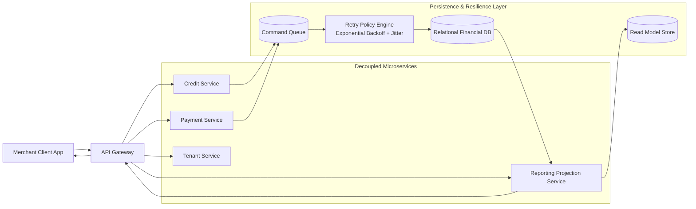

# SaaS Micro-Finance Platform Reference Architecture (ValeFiado)

This repository documents the reference architecture that guides the design of **ValeFiado** (valefiado.com), a closed-source SaaS product I own and operate, focused on digitalizing informal micro-credit operations for small merchants. The core business challenge is to provide a highly available, low-operational-cost platform that can scale across many independent shops while preserving financial correctness, auditability, and data protection.

ValeFiado addresses a common market gap: neighborhood businesses and small retailers often run credit ledgers manually, with limited visibility, weak reconciliation practices, and high operational risk. This architecture blueprint defines how to modernize that model through distributed systems patterns, resilient infrastructure, and tenant-aware isolation without exposing proprietary code.

## System Design & Distributed Patterns

### CQRS (Command Query Responsibility Segregation)

The platform separates write operations (commands) from read operations (queries) to optimize both transactional consistency and analytical performance:

- Command side:
  - Handles credit creation, installment updates, repayment postings, and account corrections.
  - Enforces strict validation, idempotency, and transactional boundaries.
  - Prioritizes financial correctness and consistency.

- Query side:
  - Serves dashboards, balance snapshots, aging reports, and merchant KPIs.
  - Uses read-optimized projections for low-latency retrieval.
  - Scales independently from command workloads.

Architectural benefits:
- Better throughput under mixed workloads.
- Reduced contention between operational writes and analytical reads.
- Clearer domain boundaries for financial events and reporting models.

### Offline-First Data Consistency

Small merchants may experience unstable connectivity. The system applies offline-first mitigation patterns to reduce business disruption:

- Local operation queue:
  - Client records critical user actions locally when connectivity is unavailable.
  - Operations are replayed in deterministic order when the network recovers.

- Idempotent synchronization:
  - Every command carries a unique operation identifier.
  - Server-side deduplication prevents double posting.

- Conflict handling strategy:
  - Domain-specific resolution rules (for example, latest valid payment timestamp with reconciliation checks).
  - Manual review fallback for ambiguous financial conflicts.

- Retry with bounded resilience:
  - Automatic retries with exponential backoff and jitter.
  - Circuit protection to avoid overwhelming degraded services.

This model preserves usability during partial outages while keeping financial ledgers coherent after synchronization.

## High-Level Architecture (Mermaid.js Diagram)

## Multi-Tenant Isolation Strategy

The platform enforces logical multi-tenancy to isolate merchant data while keeping infrastructure costs efficient.

### Data isolation model

- Tenant-scoped records:
  - Every financial entity includes tenant identifiers as mandatory partition keys.
  - No cross-tenant query is allowed without explicit privileged context.

- Row-level isolation controls:
  - Access policies bind application identity to tenant scope.
  - Query guards enforce tenant filters at repository and service layers.

- Tenant-aware indexing:
  - Composite indexes include tenant_id plus business keys to keep performance stable at scale.

### Access control boundaries

- Authentication and authorization map each user session to a tenant context.
- Administrative capabilities are segmented with elevated roles and audit trails.
- Service-to-service calls propagate tenant claims to preserve enforcement across distributed workflows.

### Auditability and compliance posture

- Tenant-scoped audit logs track who changed financial records and when.
- Sensitive operations are immutable in audit streams.
- Cross-tenant access attempts are treated as security events.

## Tech Stack & Resiliency

Recommended cost-efficient and resilient stack:

- Compute:
  - Serverless-oriented services (for example, Node.js workloads) to optimize cost under variable transaction volume.
  - Event-driven processing for asynchronous financial workflows.

- Data layer:
  - Relational database for strong consistency in financial postings and reconciliation.
  - Read projections and cache-friendly views for reporting performance.

- Security:
  - Encryption at rest with managed key infrastructure.
  - Encryption in transit with modern TLS.
  - Strict secrets management and periodic key rotation.

- Resiliency controls:
  - Retry policies with exponential backoff and jitter.
  - Idempotent command processing for replay-safe recovery.
  - Operational telemetry for latency, error rate, queue lag, and synchronization health.

This reference architecture is designed to support sustainable growth of multi-merchant micro-finance operations while preserving financial integrity, operational resilience, and predictable cost efficiency.
